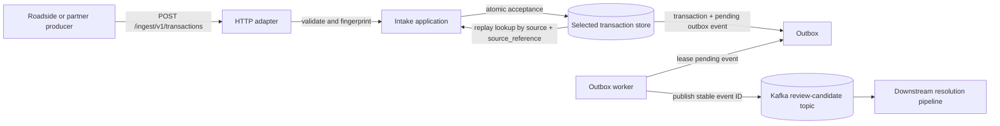

# Emovis Transaction Intake

This repository is a small, production-shaped tolling service. A roadside or partner system sends us one billable transaction; the API checks it, saves it safely, and hands a review event to Kafka for background processing.

If you only have a minute, run this:

```bash
make compose-up
curl --fail http://127.0.0.1:8080/healthz
```

Then follow the request example below. The local API key is intentionally the visible test value `local-development-only-key`; there is no key-generation step for local work. When you are done, run `make compose-down`.

The inbound contract is the supplied [OpenAPI 3.0.3 specification](api/openapi.yaml).

## Run it locally

You need Go 1.26+, Docker Desktop with Compose and Buildx, Make, and `curl`.

```bash
make compose-up
curl --fail http://127.0.0.1:8080/healthz
curl --fail http://127.0.0.1:8080/readyz
```

The local stack starts Kafka, creates the topic, and starts the API plus worker. Local authentication is disabled by default; no API key is required.

```text
X-API-Key: local-development-only-key
```

Set `AUTH_MODE=api_key` only when you explicitly want API-key enforcement. Production credentials are delivered outside Git.

Send a transaction:

```bash
curl --fail-with-body \
  -H 'Content-Type: application/json' \
  --data '{"source":"local","source_reference":"demo-0001","transaction_type":"toll","transaction_time_utc":"2026-08-16T20:30:00Z","base_amount":"7.25","transponder_number":"0180012345678"}' \
  http://127.0.0.1:8080/ingest/v1/transactions
```

The first request returns `201`. An identical retry returns `200` with `duplicate=true`; the same source/source-reference identity with changed content returns `400`.

Stop the stack when finished:

```bash
make compose-down
```

For API-only work, use `make run-api`. It uses an in-memory store, listens on `:8080`, and does not publish events without a worker. Use `make run-local` only when Kafka is already available at `localhost:9092`.

## The commands developers use

```bash
make help                 # list every supported command
make test                 # unit and contract tests
make test-race            # concurrency tests
make coverage             # require >=85% in every production package
make lint                 # formatting and go vet
make smoke                # self-cleaning API -> outbox -> Kafka flow
make test-component       # real local PostgreSQL, DynamoDB, Kafka, and secret substitutes
make test-e2e              # every local implementation through process boundaries
make validate             # complete local delivery gate
make clean                # remove repository-owned artifacts and Compose resources
```

Useful build and infrastructure checks:

```bash
make build
make build-arm64
make image-arm64
make k8s-validate
make terraform-validate
make test-infrastructure
make security
```

Docker-backed commands need Docker Desktop running. The smoke and E2E scripts clean their own named projects, including on failure.

## Configuration

Copy [`.env.local.example`](.env.local.example) to `.env` for trusted local runs. Copy [`.env.production.example`](.env.production.example) only as a production configuration inventory; it contains placeholders, not credentials. All non-example `.env*` files are ignored by Git.

The Make run targets load `ENV_FILE` first, defaulting to `.env`, and use `LOCAL_PARTNER_ID` / `LOCAL_API_KEY` as fallbacks:

```bash
make run-api ENV_FILE=.env.local
```

The Go service recognizes `HTTP_ADDRESS`, `PARTNER_ID`, `API_KEY`, `AUTH_MODE`, `TRANSACTION_TYPES`, `DEFAULT_CURRENCY`, `STORE_DRIVER`, `STORE_PATH`, `POSTGRES_URL`, `DYNAMODB_ENDPOINT`, `AWS_REGION`, `DYNAMODB_TABLE`, `KAFKA_BROKERS`, `KAFKA_TOPIC`, `KAFKA_TLS`, `KAFKA_CA_FILE`, `KAFKA_SASL_USERNAME`, `KAFKA_SASL_PASSWORD`, `LOCAL_SECRET_FILE`, and `AWS_SECRET_ID`. `AUTH_MODE` defaults to `disabled`; set it to `api_key` to enforce the configured partner/API key. `TRANSACTION_TYPES` defaults to `toll`, and `DEFAULT_CURRENCY` defaults to `USD`. Topic bootstrap additionally uses `KAFKA_TOPIC_PARTITIONS`, `KAFKA_TOPIC_REPLICATION`, and `KAFKA_TOPIC_RETENTION`. See the example files and [the infrastructure reference](docs/infrastructure/reference.md) for defaults and secret-provider behavior.

## Terraform requires a deliberate storage choice

Terraform never chooses a database implicitly. `storage_backend` is required and must be either `dynamodb` or `postgres`.

```bash
make terraform-plan TFVARS=dynamodb.tfvars.example
# or
make terraform-plan TFVARS=postgres.tfvars.example
```

Calling `make terraform-plan` without `TFVARS` fails intentionally. Each plan creates shared networking/EKS/MSK/encryption resources plus only its selected persistence module. No Make target runs `terraform apply`.

See the [storage-selection ADR](docs/adr/2026-08-17-explicit-storage-infrastructure-selection.md) and [AWS infrastructure reference](docs/infrastructure/reference.md).

## Architecture

### Request and delivery flow



```text
partner / roadside system
          │ POST /ingest/v1/transactions
          ▼
      HTTP adapter
          │ authenticate, decode, validate
          ▼
    Intake application
          │ atomic accept
          ├── transaction record
          └── pending outbox event
                         │ leased claim
                         ▼
                   Kafka publisher ──► review-candidate topic
```

The API rejects malformed or unknown JSON fields, validates the billable transaction, and computes a canonical fingerprint. The idempotency boundary is `source:source_reference`. A replay returns the original system ID and does not create another event.

### Dependency direction

```text
domain → application ports → adapters
                         ├── HTTP
                         ├── memory / NDJSON
                         ├── PostgreSQL / DynamoDB
                         └── Kafka
```

The domain imports no transport, database, cloud, or Kafka package. Commands are composition roots: they load configuration, select adapters, and own process lifecycle. This is a ports-and-adapters design so local substitutes and cloud implementations share the same behavior contracts.

### Transactional outbox

The selected store atomically saves the accepted transaction and a pending event. A worker claims pending events in batches, publishes them to Kafka, and marks them published. Claims carry opaque ownership tokens; a worker whose lease expired cannot mark a reassigned event successful or failed. Failed events use bounded exponential retry and eventually become terminal failures. Delivery is at least once, so consumers must deduplicate by immutable `eventId`.

Memory storage is concurrency-safe but ephemeral. NDJSON is durable and intended only for combined local mode. PostgreSQL and DynamoDB are repository implementations of the same storage port; they are not used simultaneously in one Terraform deployment.

### Kafka contract

The default topic is `transaction.review-candidates.v1`. Messages use `source:source_reference` as the key and contain the event ID, schema version, UTC timestamps, source identity, and the validated toll payload. API keys, authorization headers, SASL credentials, and payment credentials never enter events. Local Kafka is single-node plaintext; the AWS reference uses TLS and SASL/SCRAM through externally populated Secrets Manager values.

### Runtime modes

- `api` — HTTP intake only; production uses a shared selected cloud store.
- `worker` — outbox dispatch only; shares the selected store with the API.
- `local` — one process with a shared memory or NDJSON store and Kafka publisher.
- `topic-bootstrap` — short-lived topic configuration command.

Readiness checks the selected intake store with a bounded timeout. Kafka is asynchronous and is not an API readiness dependency. Liveness, readiness, and Prometheus metrics are exposed at `/healthz`, `/readyz`, and `/metrics`.

### Cloud shape and security

The AWS reference uses private subnets, EKS, MSK, one explicitly selected persistence backend, KMS encryption, IRSA, least-privilege workload IAM, Secrets Manager, non-root immutable images, and deletion protection defaults. Terraform validates and plans locally but never applies automatically. Real secret values, image digests, ingress/TLS/WAF choices, remote state, and account approval remain operator decisions.

Security controls include constant-time API-key comparison, bounded request bodies, strict JSON decoding, SQL parameters, secret redaction, output-safe events, TLS/SASL for cloud Kafka, vulnerability and secret scans, and offline Kubernetes/IaC policy checks.

## Testing and repository guidance

All production behavior follows red-green-refactor: focused tests are written first, observed failing, then implemented and rerun before refactoring. Unit tests cover domain/application behavior; component tests run real local substitutes; E2E tests exercise each local implementation through HTTP, storage, outbox, and Kafka.

The [behavior-to-test matrix](docs/testing/behavior-matrix.md) maps important behavior to its tests. Repository-specific instructions are in the root [AGENTS.md](AGENTS.md) and one linked `AGENTS.md` exists for every authored directory. Reusable coding-agent guidance lives in `.codex/skills/`.

The completed review and implementation records are archived under [`docs/plans/archive`](docs/plans/archive). Architecture rationale is recorded under [`docs/adr`](docs/adr).
