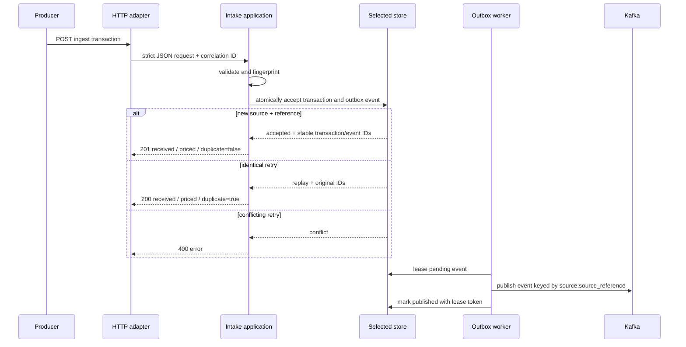

# Transaction Ingest System Architecture

_Current as of 2026-08-17_

## Purpose

This service accepts one billable tolling transaction from a producing system, validates it, durably records it exactly once per producer reference, and makes it available to a downstream resolution pipeline. It deliberately does not associate a vehicle to a customer, change pricing, or collect payment.

## Inbound contract and lifecycle

The public business endpoint is `POST /ingest/v1/transactions`, defined in [`api/openapi.yaml`](../../api/openapi.yaml). A request supplies its producer identity (`source`), producer reference (`source_reference`), type, UTC transaction time, decimal-string base amount, and at least one vehicle identifier: a plate or a transponder number. It can also carry location and audit metadata.

`source` plus `source_reference` is the idempotency key. A first accepted request returns `201`; the same validated payload returns `200` with `duplicate=true` and the original system ID. A different payload for the same key returns `400`, protecting a billable record from silent overwrite.

## Component boundaries

The code follows ports and adapters.

- The **domain** owns transaction values, deterministic validation, and canonical fingerprints. It does not import HTTP, Kafka, database, AWS, or configuration code.
- The **application** owns the intake use case, idempotency outcomes, and the transactional-outbox conversation with storage.
- The **HTTP adapter** bounds bodies, requires JSON, preserves presence/null distinctions, accepts unspecified schema properties, maps errors, and exposes operational health extensions.
- The **storage adapters** implement one shared acceptance/outbox port. Memory, NDJSON, PostgreSQL, and DynamoDB are selectable implementations, not concurrent replicas.
- The **Kafka adapter** publishes versioned review-candidate events after durable acceptance. Consumers deduplicate because delivery is at least once.
- The **bootstrap and command packages** load configuration, choose adapters, configure authentication, and start API, worker, local, or topic-bootstrap modes.

## Durable acceptance and delivery

The store atomically persists the transaction and a pending outbox event. This prevents the common failure where a request succeeds but a Kafka publication is lost. The worker claims events using a time-limited lease and opaque claim token. Only the active claimant can mark publication complete or schedule a retry; expired claims can be reclaimed. Failed deliveries use bounded exponential retry and can reach a terminal failure state for operations to investigate.

Kafka messages use `source:source_reference` as the key and include the stable event ID, transaction ID, timestamps, source identity, and validated payload. They never include API keys, authorization headers, broker credentials, or payment credentials.

## Runtime and deployment shape

`api` runs HTTP intake only. `worker` dispatches outbox events only. `local` runs both together for developer workflows, and `topic-bootstrap` creates or verifies the Kafka topic.

Local development uses Docker Compose and local implementations: Kafka, memory or NDJSON storage, PostgreSQL, DynamoDB Local, and file-backed secret fixtures. Every external boundary has a local confirmation path; the test suite exercises valid ingestion, replays, conflict handling, persistence, delivery, and cleanup without cloud credentials.

The production-oriented AWS shape uses EKS, MSK, one explicitly selected PostgreSQL or DynamoDB backend, Secrets Manager, IRSA, KMS encryption, private networking, non-root immutable images, and Kubernetes health probes. Terraform intentionally validates and plans only; applying infrastructure, choosing ingress/TLS/WAF, providing image digests, and supplying real secrets remain operator decisions.

## Security and operations

The normal local configuration has `AUTH_MODE=disabled`, matching the supplied contract's `security: []`. Deployments can set `AUTH_MODE=api_key`; configured credentials are compared in constant time and provisioned outside Git. `TRANSACTION_TYPES` defines allowed event types and `DEFAULT_CURRENCY` supplies an omitted request currency.

The service uses presence-aware decoding, request-size bounds, SQL parameters, storage-specific atomicity, output-safe Kafka envelopes, TLS/SASL for cloud Kafka, and secret/vulnerability scanning. Liveness, readiness, and Prometheus-format metrics remain available at `/healthz`, `/readyz`, and `/metrics` as operational extensions to the supplied ingest contract.

## Verification

`make validate` runs formatting, linting, unit and race tests, contract checks, 85% per-package coverage, Docker image validation, Compose component tests, end-to-end profiles, Terraform/Kubernetes checks, documentation and instruction-hierarchy checks, and security scanning. See [`README.md`](../../README.md) for commands and [`docs/testing/behavior-matrix.md`](../testing/behavior-matrix.md) for behavior-to-test mapping.
