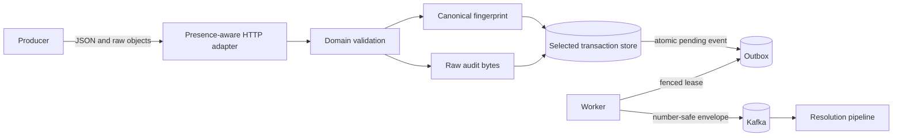

# OpenAPI-Conformant Transaction Intake Architecture

_Current as of 2026-08-18_

## Contract boundary

[`api/openapi.yaml`](../../api/openapi.yaml) is byte-identical to the supplied OpenAPI 3.0.3 contract and contains only `POST /ingest/v1/transactions`. The service also exposes `/healthz`, `/readyz`, and `/metrics`, optional API-key enforcement, a 64 KiB body limit, media-type and method guards, conflict classification, and dependency-failure responses. These are operational extensions, not additions to the supplied producer contract.

The HTTP adapter decodes the top-level object into `json.RawMessage` fields so missing, explicit null, empty, and present values remain distinct. It requires the five named properties, permits unspecified properties, permits null only for `currency` and `transponder_number`, parses arbitrary objects with `UseNumber`, and rejects a non-zero timestamp offset. Domain validation applies runtime-configured transaction types, Unicode code-point limits, identifier rules, and fixed-point decimal syntax.

## Audit and idempotency representations

`location` and `metadata` have two representations with different jobs:

- Raw bytes preserve the producer's object value for audit and dispute handling.
- Parsed, number-safe values support structured adapters and Kafka mapping.
- A canonical JSON form sorts object keys and removes insignificant whitespace without converting numbers through floating point.

The idempotency key is exactly `(source, source_reference)`. The canonical fingerprint distinguishes an identical retry from different content under that key. A new transaction returns `201`; an identical replay returns the persisted ID with `200`; conflicting content returns the repository extension `400` without overwriting the accepted record.

## Storage mappings

- Memory copies raw byte slices so caller mutation cannot alter accepted evidence; it is explicitly ephemeral.
- NDJSON base64-encodes raw byte fields beside the structured acceptance record and restores them across restart. It is the durable, credential-free default Compose store and remains single-process only.
- PostgreSQL stores structured payloads in JSONB and exact raw values in nullable `BYTEA` columns on both transaction and outbox rows. Idempotent `ALTER TABLE ... ADD COLUMN IF NOT EXISTS` statements preserve existing installations.
- DynamoDB stores structured payloads plus optional binary raw attributes on transaction and outbox items. Missing attributes remain a supported backward-read shape.

Every store atomically writes the transaction and pending event. Outbox publication remains at least once, uses stable event IDs, and requires consumer deduplication.

## Local and production operation

`make compose-up` runs Kafka, topic bootstrap, a least-privilege NDJSON volume initializer, and the combined API/worker application. `make compose-down` removes this repository's containers, network, and volume. `make run-api` intentionally remains memory-backed and ephemeral. PostgreSQL, DynamoDB Local, TLS/SCRAM Kafka, and file-backed secret providers have independent component and E2E paths.

Production infrastructure retains explicit PostgreSQL-or-DynamoDB selection, EKS, MSK, Secrets Manager, private networking, encryption, and least-privilege identities. No local validation requires AWS credentials or runs Terraform apply.

## Security and failure behavior

The server bounds bodies, headers, reads, writes, and idle connections; uses parameterized SQL; compares configured API keys in constant time; excludes secrets from events and configuration strings; and keeps optional authentication disabled by default to match `security: []`. Invalid requests receive numeric-code JSON errors without internal details. Kafka unavailability does not undo accepted transactions because the pending event is already durable.

## Verification

Byte-equality and parsed semantic suites protect every supplied schema, reference, description, example, and response. Focused tests cover presence, nullability, UTC, Unicode, currency, decimals, identifiers, raw bytes, canonical fingerprints, and Kafka mapping. Adapter tests cover copying and restart. Component and E2E suites exercise all local substitutes, and `make validate` combines race, coverage, architecture, infrastructure, security, and cleanup gates.

